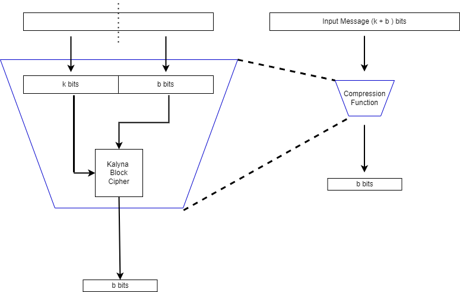

# Hash

Compression Function

- To create The Hashing algorithm we first use the Block Cipher in the above structure to create a compression function
- We use the First $k$  bits as the Key and the next $b$  bits as the Plaintext for the Block Cipher Primitive
- The output $b$  bits is the output Ciphertext
- We can chain this compression algorithm to produce a hash function (seen below)
- The message is broken into blocks of size $k$ bits
- We pad it with necessary amount of $0$ bits to the end of the file till it reaches the desired length.

Hash Function