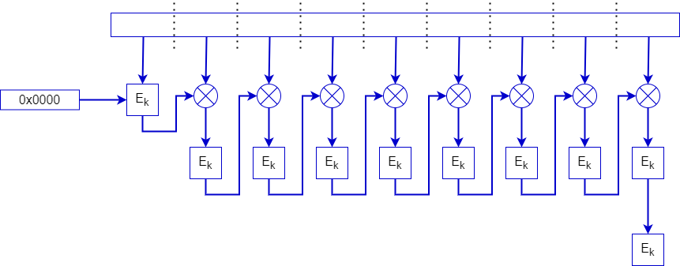

# MAC

- Using the Kalyna Block Cipher as a primitive we have also created a MAC
- We have use the CMAC structure with some slight changes to create our MAC

- We use this MAC for authentication purposes in both File Encryption and chat message authentication.